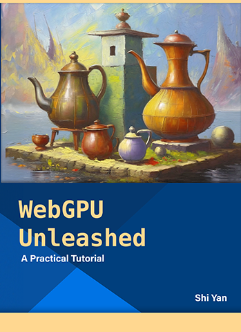

# WebGPU Unleashed: A Practical Tutorial



Welcome to the code samples for 'WebGPU Unleashed: A Practical Tutorial', your ticket to the dynamic world of graphics programming.

Dive in and discover the magic of creating stunning visuals from scratch, mastering the art of real-time graphics, and unlocking the power of WebGPU - all in one captivating tutorial.

Get started [here](https://shi-yan.github.io/WebGPUTutorial/) with the live online editor, or clone this repo and start a web server from the root directory. For example:

```bash
python3 -m http.server
```
